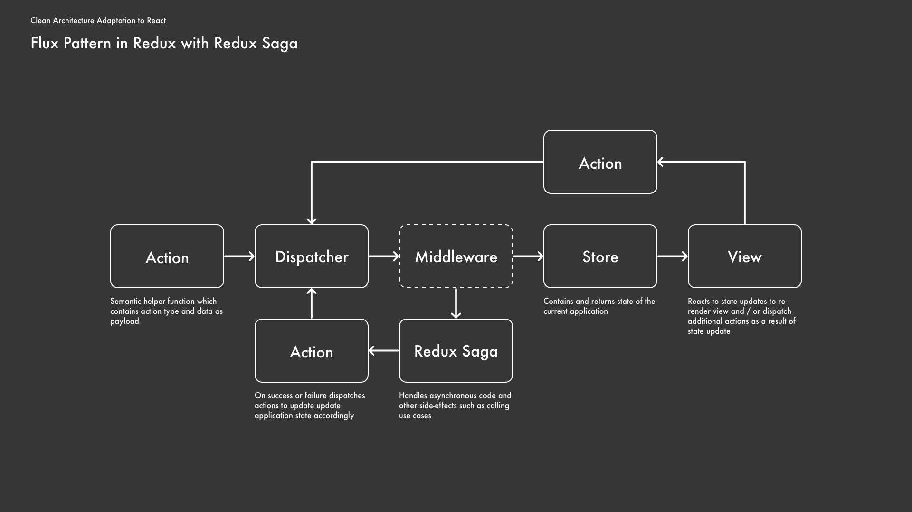
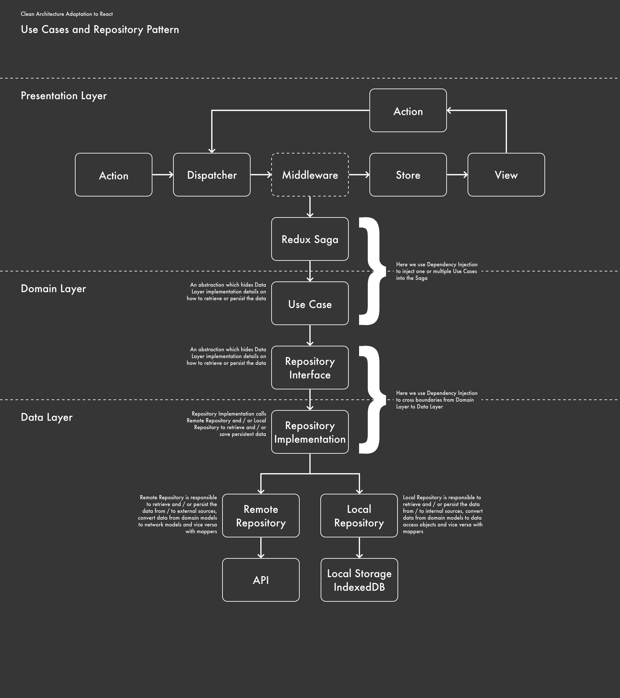
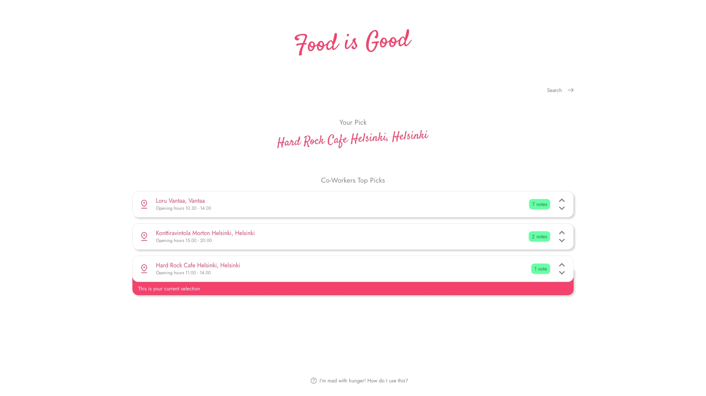
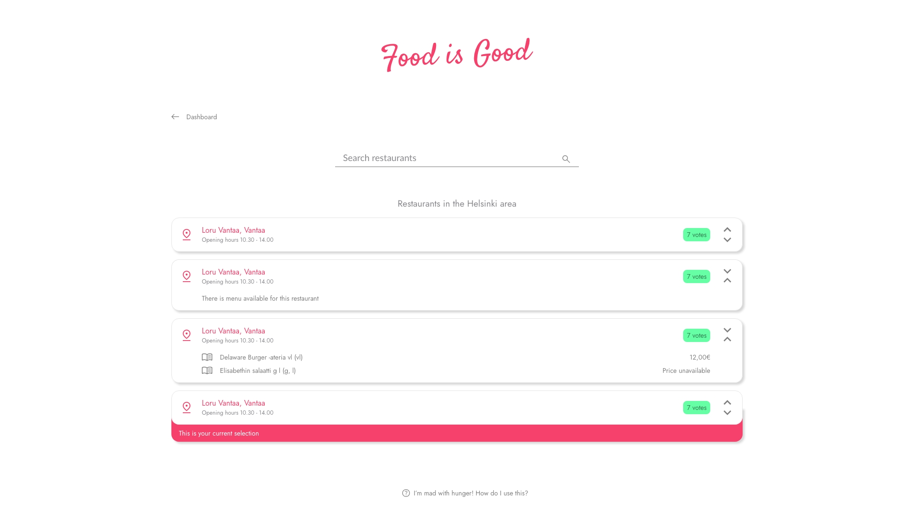
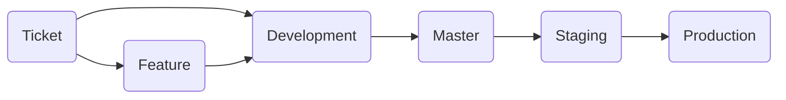

# Food Is Good App

> Onko työ/kaveriporukassasi eripuraa ja "nokkapokkaa" missä tänään syödään? Ei hätää!
>
> Tehtävänäsi on demokratisoida lounaspaikan valintaprosessi
> toteuttamalla äänestyssovelluksen frontend.
>
> Tehtävän toteutusta varten saat valmiin backendin, jonka mukana
> tulevaan API-dokumentaatioon pääset tutustumaan.
>
> Toteutuksessa käytettävät teknologiat ovat vapaasti päätettävissäsi.
>
> Sovelluksessa tulee olla seuraavat toiminnot:
>
> - Lounaspaikkojen haku
> - Äänen antaminen, muuttaminen ja poistaminen
> - Päivän äänestystuloksen esittäminen reaaliajassa
>
> Katso vielä lisätiedot tehtävän arviointikriteereistä sekä tarkempi
> ohje siitä, mitä palautuksessa tulee huomioida.
>
> Onnea koodihaasteeseen ja mukavaa (kesä)koodailua!

## Preview

You can find live deployment at https://solidabis-app.azurewebsites.net/ for the user interface and https://solidabis-server.azurewebsites.net/ for the server.

The deployment have been done to Azure App Services with simple GitLab CI / CD functionalities which deploy to Azure Container Registry which in turn deploys with simple hooks the latest images.

## Installation

Most of the instructions below assume that current working directory is proper one

- "Food Is Good" user interface launches on localhost port 80
- "Food Is Good" server launches on localhost port 8080

### Scripts

#### Makefile

To launch application containers with tiny shell CLI you can use Makefile `make` commands (if not on Unix system see [StackOverflow](https://stackoverflow.com/a/32127632/12660598))

To launch / orchestrate all Docker containers run

    make docker

Then in the CLI select

1.  **Option 3** to "Compose"

2.  **Option 1** to "Up"

To see all available Makefile commands run

    make help

#### Docker

To launch application as Docker container run

    docker run -p <your-localhost-port>:80

To launch / orchestrate all Docker containers run

    docker-compose -f compose.development.yml up

#### Yarn

To install dependencies run

    yarn install

To run development version of the application with Webpack run

    yarn start:dev

To build production version of the application with Webpack run

    yarn build:prod

To launch built version of the application consider installing ex. http-server though Docker is de-factor way to run the application

#### Tests

To run tests run

    yarn test

To run test coverage by Jest run

    yarn test:coverage

You can find static index.html which Jest generates in ./coverage/lcov-report/index.html which you can open up in your browser directly

## Solution

### Architectural Patterns

- [Clean Architecture](https://blog.cleancoder.com/uncle-bob/2012/08/13/the-clean-architecture.html) adaptation to modern single-page applications with [SOLID](https://en.wikipedia.org/wiki/SOLID) principles using [Inversify](https://inversify.io/) for IoC and DI
- [Flux Pattern](https://facebook.github.io/flux/docs/in-depth-overview/) with Redux, ReduxToolkit and Redux Saga to manage side-effects
- [Repository Pattern](https://martinfowler.com/eaaCatalog/repository.html) for managing data retrieval and persistence from different resources
- Mismash combination of OOP principles together with FP / FRP libraries such as RxJS and Ramda as long as its clean and consistent

### Description

Simple app where user can see their vote and their co-workers vote. User can search lunch restaurants by city, click to see their location, menu, votes and which lunch restaurant is their selection for the current day. User can also choose language between English and Finnish.

### Design

### Features

- Modern linter setup with ESLint and best practices which lints code styles, commit messages and runs tests. Overall professional TypeScript setup with all the syntactic sugar it provides such as Module Augmentation to extends and / or override ex. Material UI theme types

- Decent UI / UX (with Material UI Imo though I'm no professional when it comes to design) including all basic features as per assignment. However, Material UI is rather poor on accessibility. Theme color is the same as Solidabis uses in their brandmark

- Decent units tests with React Testing Library, Jest and Mock Service Worker covering most of the codebase (75.53% lines). However, the philosophy for testing is that of React Testing Library which also Redux encourages on their [official website](https://redux.js.org/usage/writing-tests). For more information on this see React Testing Library [official website](https://testing-library.com/docs/guiding-principles/). In short, there are no tests for the underlying implementation details as these can change and should require tests only for critical applications where availability and particular logic is of paramount importance

- Various scripts and deployment options to make it easy to run the application (though relies mostly on Docker)

- PWA support / compatibility with Workbox which check at least Google Chrome's installability requirements. In other words feel free to install this app on your machine or mobile device and give it a try

- Retrieves updates to voting results every 5 minutes from the server with long polling using custom hook (TS rewrite from the [original solution](https://overreacted.io/making-setinterval-declarative-with-react-hooks/) by Dan Abramov) as the given server implementation does not have any websocket support. For an example how I would implement Websockets with React see my accepted Stackoverflow [answer](https://stackoverflow.com/a/67201479/12660598)

- JSDoc comments on most of the core functions

- Retrieves Finnish cities / municipalities from common open Finnish API and persists results after initial retrieval to Indexed database (in "real life" scenario this should have expiration time to refetch data from time to time)

- Decent error handling with React error boundary and global API exception handler. The idea is that whenever there is an error user should get notification about it. The same goes for loading any assets or data. In total crash there is user-friendly fallback page though it should never come to that

### Pitfalls

- Test coverage though on purpose is not 100%

- Accessibility due to the chosen UI library Material UI is rather poor

- There are no Websockets or rooms to separate between different workplaces and provide better live result updates to the user

- It can be unclear to how to use the application as it might not be obvious that simply by clicking on the item selects it. Also to add to the confusion by clicking on different areas the item either open up a Google Maps location of the restaurant or expands to show the menu

- Most likely an overkill overall architecture / architectural patterns for such an simple app

## Documentation

### Conventions

#### Commits

The [Commitlint](https://commitlint.js.org/#/) enforces best practices together with [Commitlint Jira rules](https://github.com/Gherciu/commitlint-jira). The commit message issue status must comply with [default Jira statuses](https://confluence.atlassian.com/adminjiracloud/issue-statuses-priorities-and-resolutions-973500867.html) which follow task ID (from Jira board or as running repository prefix and enumeration), task description (as abbreviation), and commit message which must be in present tense. These must all be in capital letters.

Format

    git commit -m "[<ISSUE-STATUS>]<TASK-ID>: [<TASK-DESCRIPTION>] <message>"

As an example

    git commit -m "[CLOSED]TASK-1: [CONF] Create .gitlab-ci.yml production branch CI / CD pipeline

##### Task descriptions

- [CONF] Informs that the ticket task description concerns configuration

- [FEAT] Informs that the ticket task description concerns feature

- [UPDT] Informs that the ticket task description concerns update to an existing feature / capability

- [FIX] Informs that the ticket task description concerns fix to a particular known issue / bug

_The option to include custom commit rules to include all possible scenarios is up to later consideration_

#### Branching Strategy

##### Overview

There are three main branches — development, staging, and production. These branches contain CI / CD pipeline which builds to corresponding domain / FQDN ex. https://\<branch>.\<domain>.\<domain-extension>

##### Ticket

The ticket branch can branch out from either development branch or feature branch. Once complete the ticket branch merges always back to its parent branch. The only exceptions are unconventional situations where there is requirement to ex. cherry pick a particular commit higher in the tree to patch issues which require immediate attention. The ticket branch name derives from Jira board in use.

##### Feature

The feature branch can branch out only from the development branch. Once complete the feature branch merges always back to its parent branch. The feature branch name has "feature-" prefix which follows brief feature description ex. feature-password-reset.

##### Development

The development branch contains latest code.

##### Master

The master branch must contain at all times ready code ready for release to staging.

##### Staging

The staging branch must contain at all time ready code ready for release to production. Releases to this branch require appropriate version tag as a release candidate postfix and message.

Format

    git tag -a <semver>_rc<number> -m "<message>"

As an example

    git tag -a 1.0.0_rc1 -m "Release 1.0.0~rc1 to staging"

##### Production

The production branch contains latest official release. Releases to this branch require appropriate version tag and message.

Format

    git tag -a <semver> -m "<message>"

As an example

    git tag -a 1.0.0 -m "Release 1.0.0 to production"

#### Versions

The [Semantic Versioning](https://semver.org/) applies.
